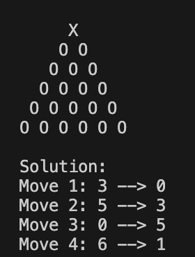

# peg-game-solver

###### Tags: Python, C, CMake
<br>

Solves the peg game described in https://github.com/chrisdana/watch-peg-game
with peg positions ordered from top to bottom, left to right (shown below).
Game boards with 4, 5, or 6 rows are supported.

```
                 0
              1     2
           3     4      5
        6     7      8     9
     10    11    12    13    14
  15    16    17    18    19    20
```

## Building/Running

### Python

Requires Python 3.x (https://www.python.org/downloads/)
```
Usage: python3 peg-game-solver.py [NUM_ROWS]
Example: python3 peg-game-solver.py 5
```

### C

Build with your favorite C compiler directly, or use the included CMakeLists.txt to generate build files.  For example, on a system with GNU make:
```
mkdir build
cd build
cmake ..
make
./peg-game-solver 5
```

## Screenshots

 
